Đây sẽ là một bài viết không chứa "AI đã giúp tôi làm điều này trong 3 giây", hay "tôi đã vibe code ra...trong 30p" mà sẽ mang đến cho bạn guide từ A-Z, cái nhìn toàn cảnh, những sự thật mất lòng về build với AI, những tips and trick để bạn làm chủ AI để tăng tốc thật sự trong công việc, cuộc sống.


**Disclaimer:** 
- Bài hướng dẫn được viết với góc nhìn của mình, một người có background là marketing, business development, không học code nhưng có niềm đam mê bất tận với công nghệ và AI. 
- Bài hướng dẫn dành cho các bạn mới non-tech, marketer chưa full-stack, chưa biết gì về code, đang sử dụng AI chủ yếu qua chat, muốn khám phá khả năng xây dựng và làm chủ sản phẩm từ AI. Vì mình tin, nếu không nắm bắt ngay từ bây giờ, khoản cách giữa người biết AI và sử dụng AI sẽ được kéo giãn.
- Và hãy trả phí cho AI khi bạn muốn tận dụng hết sức mạnh, đừng tiếc vì những gì AI làm được là "worth every penny". Mình nghĩ $10 là chi phí hợp lý để khởi đầu, ngoài ra thì có những nền tảng cho trial 30 ngày, hoặc như Google thì mua Google One là vừa có AI vừa có dung lượng.

**Các kiến thức cần chuẩn bị:**
- Kiến thức về GitHub, IDE và các câu lệnh cơ bản trên Terminal như `cd <thư_mục>`: di chuyển giữa các thư mục hay `ls`: liệt kê file/thư mục.

## Dấu chấm đầu tiên: prompt đi, đừng nghĩ nhiều

Khả năng prompting là cần thiết, nhưng khi khả năng thinking của AI ngày càng tốt, bạn vẫn có thể bắt đầu một cách sơ khởi với một prompt cơ bản và bằng Tiếng Việt. Vì vậy, khi bạn có nhu cầu hay ý tưởng, prompt đi. 
### Prompt ở đâu?

Hiện có những nền tảng sau đây mình cho là rất ổn khi bắt đầu cho việc build landing page hay cả những sản phẩm phức tạp hơn một chút như web app:
- **[Google AI Studio](https://aistudio.google.com):** không cần tài khoản Gemini Pro để bắt đầu build với Google AI Studio. Google AI Studio với Gemini 3 Pro có khả năng build giao diện khá ổn. Ngoài ra thì Nano Banana gen hình tốt có thể làm cho landing page bắt máy hơn.
- **[Lovable](https://lovable.dev/):** 5 credit free hằng ngày, nếu share cho bạn bè thì nhận được thêm 15 credit nữa. Build giao diện đẹp, prompt cơ bản mất tầm 2 credit, 1 ngày có thể prompt được 3 lần tùy vào độ phức tạp của prompt
- **[V0](v0.app):** với mình V0 là nền tảng backup cho 2 nền tảng trên khi bạn cần thêm ý tưởng.

Điểm chung của 3 nền tảng này, là có thể connect với GitHub. GitHub như một ngân hàng lưu trữ source code của riêng bạn, và miễn phí. Ở đây để demo, mình sẽ sử dụng Lovable và Google AI Studio, nền tảng nào ra UI đẹp thì mình sử dụng. Project trong bài hướng dẫn này sẽ là build một landing page để xây portfolio cho một bạn BD ngành nội thất, xây dựng.

Lưu ý: Khi prompt với Google AI Studio hãy lưu ý với Gemini Services hay được chèn vào, gây ra lỗi khi sử dụng phát triển trên local. Mình sẽ nói chi tiết ở phần sau.

### Prompt như thế nào?

Hãy gói gọn yêu cầu của bạn bằng 3 gạch đầu dòng sau đây:
- Purpose: Cho AI biết mục đích build landing page của bạn. Dùng để bán hàng, xây dựng portfolio, company profile...
- Mood and tone: màu sắc phong cách mà bạn thích.
- Function: tính năng mà bạn muốn, ví dụ: có form đăng ký, có hero section hấp dẫn, có nút CTA...
- Audience: phần này là phụ, miêu tả nhóm audience nào sẽ truy cập landing page của bạn.
- Hoặc chỉ viết những gì bạn đang mong chờ và chờ đợi kết quả từ AI.

Tips:
- Bạn có thể prompt hoàn toàn bằng tiếng Việt.
- Nếu chưa biết cách prompt, hãy sử dụng bất kì một AI nào (ChatGPT, Gemini, Grok,...) và yêu cầu nó hỏi bạn các câu hỏi nhằm phục vụ cho việc viết cho bạn một prompt hoàn chỉnh.

```
Xây dựng landing page:
- Mục tiêu: landing page là portfolio của tôi là một Business Development trong ngành nội thất. Tôi giúp khách hàng có được những giải pháp tốt nhất về các sản phẩm vật liệu dán tường, rèm cửa cũng như tư vấn trọn gói thiết kế nội thất cao cấp.
- Mood and tone: landing page phải thể hiện sự chuyên nghiệp, sử dụng màu sắc sang trọng nhưng không cầu kì.
- Tính năng: form đăng ký tư vấn, thể hiện các dự án tôi đã thực hiện cho khách hàng. Thông tin liên hệ nổi bật.
```

| Hero section: khá đẹp và bắt mắt, đúng những gì yêu cầu.                                                                                         |  |
| ------------------------------------------------------------------------------------------------------------------------------------------------ | ------------------------------------ |
| About me: không prompt giới tính nên là Gemini tự pick là nữ                                                                                     |  |
| Phần dịch vụ còn hơn đơn giản                                                                                                                    | 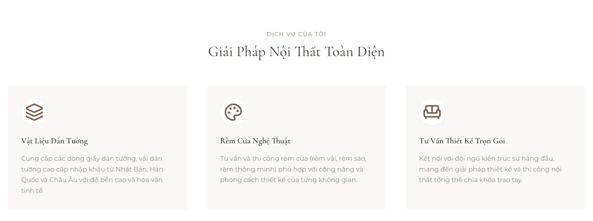 |
| Phần liên hệ đúng brief                                                                                                                          | 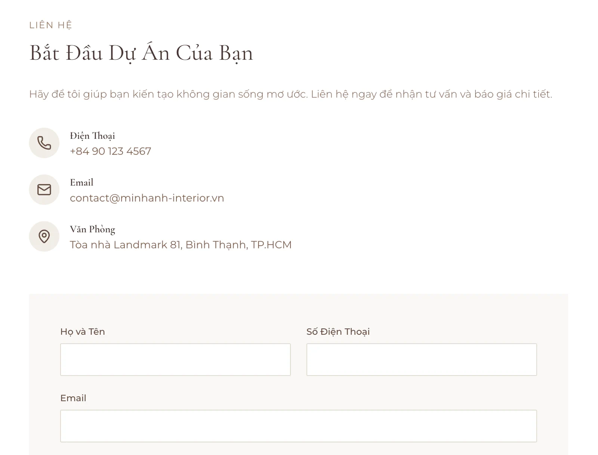 |
| Dự án tiêu biểu lấy màu sang và nhờ Banana Pro nên hình gen đẹp                                                                                  | 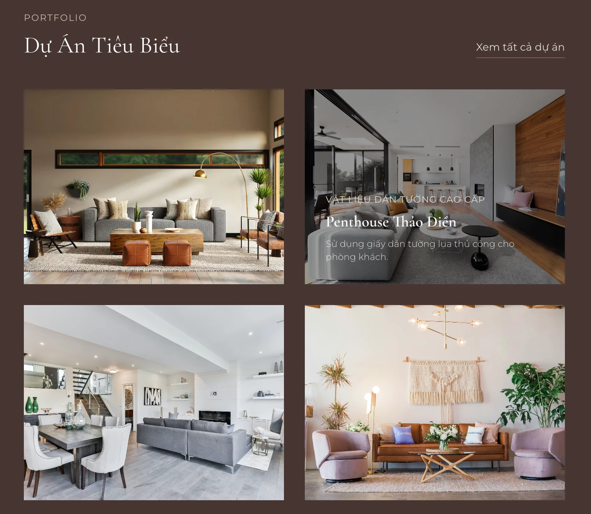 |
| Khi prompt bằng Google AI Studio thì Gemini hay tự thêm phần chat với AI vào để người dùng sử dụng Gemini. Bạn có thể nói bỏ nếu không cần thiết | 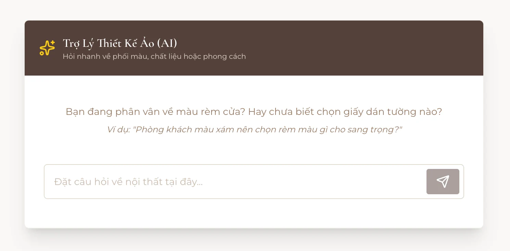 |
| Footer cơ bản                                                                                                                                    |  |

### Mấy bài hướng dẫn hay dừng lại ở đây

Và các bạn mới thường đi vào ngõ cụt vì:
- Nếu không xài Google AI Studio mà xài Lovable lỡ prompt hết credit rồi sao làm tiếp?
- Mà nếu prompt ổn quá, muốn lấy về xài mà cái link vừa xấu vừa dài, mà còn .lovable hay .ai.studio nữa. Lỡ làm đồ cho công ty thì bị nói xài AI mà làm cho khách hàng thì không chuyên nghiệp.
- Lấy ví dụ landing page vừa tạo có cái form, rồi khách hàng điền form của mình xong dữ liệu đi đâu?
- Hoặc các function không chạy tiếp được do phụ thuộc vào chính nền tảng.

Vì vậy 30 phút build xong cái gì đó bởi AI như mấy KOL Facebook hay đăng bài không đi tới đâu.

## Dấu chấm thứ hai: làm chủ AI và thật sự build sản phẩm của chính bạn

Phần này sẽ mang đến:
- Cách sử dụng GitHub là nơi chứa source code project của bạn khi hoàn tất prompt với AI. Mình dùng chữ project vì có thể chứa được mọi thứ không chỉ là landing page.
- Kéo project từ GitHub về máy tính cá nhân để phát triển với ChatGPT Codex và Cursor.
- Đẩy project từ máy tính cá nhân lên hosting miễn phí, đầy đủ bảo mật như Netlify hay CloudFlare.
- Kết nối sử dụng tên miền cá nhân hóa của bạn cho landing page như quangha.me.

### Đẩy source code landing page lên GitHub

Mình sẽ gọi landing page của bạn là project, ở bước này hãy kết nối project của bạn với GitHub. Nếu bạn chưa có tài khoản GitHub, hãy tạo và làm quen với các khái niệm như repo, và các câu lệnh git push, git add, git commit. Khi source code nằm trên GitHub của bạn, là bạn đã và đang sở hữu chúng, toàn quyền **chỉnh sửa**, **phát triển** và **xây dựng thêm mà không còn phụ thuộc vào nền tảng nào khác.

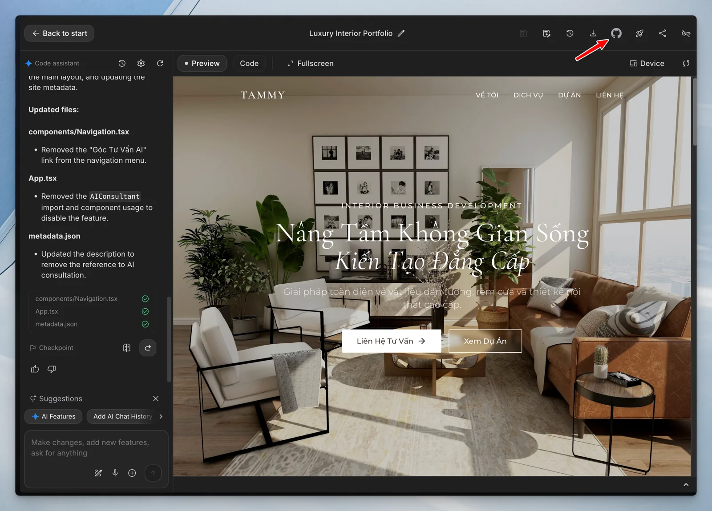

Một vài khái niệm GitHub cơ bản:
- Repository (repo): “kho” chứa toàn bộ mã nguồn và lịch sử thay đổi của dự án.
- Commit: ảnh chụp trạng thái mã nguồn tại một thời điểm, kèm thông điệp mô tả thay đổi.
- Branch: nhánh làm việc tách biệt để thử nghiệm hoặc phát triển tính năng mà không ảnh hưởng nhánh chính.
- Pull Request (PR): đề xuất gộp nhánh/commit vào nhánh chính, nơi bạn (hoặc team) xem xét và duyệt thay đổi.
- Clone/Pull: tải mã nguồn về máy cá nhân và cập nhật thay đổi mới nhất từ repo.

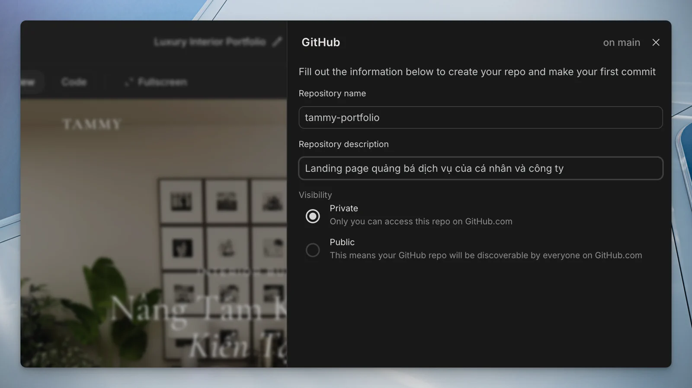

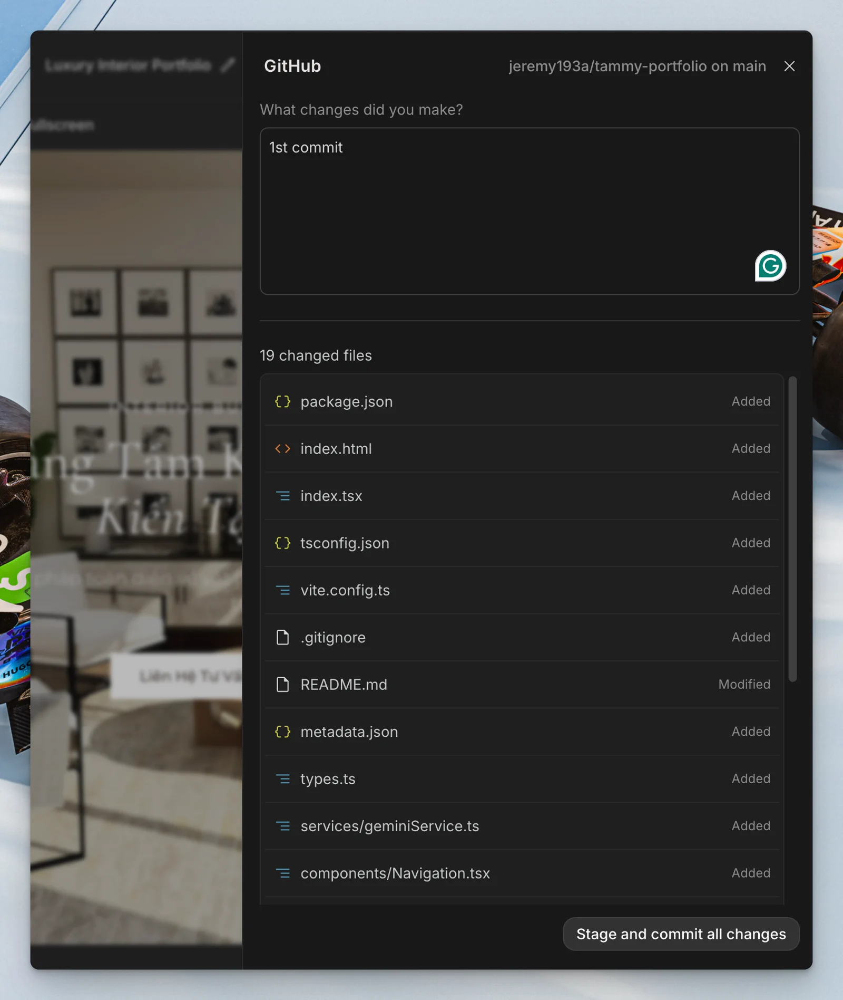

### Từ GitHub đẩy thông tin lên hosting Netlify hay CloudFlare Pages

### Cloudflare Pages và Netlify là gì?
Cloudflare Pages và Netlify là **nền tảng deploy website tĩnh (static site)** miễn phí và nhanh.
#### Dùng để làm gì?
- Deploy landing page, portfolio, blog, hoặc các project frontend.
- Tự động build & deploy khi bạn push code lên GitHub.
#### Đặc điểm nổi bật
**CloudFlare Pages**
- Tốc độ cực nhanh (CDN toàn cầu).
- Được tối ưu bảo mật tự nhiên từ Cloudflare.
- Hỗ trợ preview branch (test trước khi merge).
**Netlify**
- UI dễ dùng, setup nhanh.
- Hỗ trợ form submission ngay cả khi site là static.
- Auto-deploy mỗi lần bạn push lên GitHub.
- Preview build cho mỗi branch.
### So sánh đơn giản cho người mới

| Tiêu chí        | Cloudflare Pages   | Netlify     |
| --------------- | ------------------ | ----------- |
| Mức độ dễ dùng  | Trung bình         | Rất dễ dùng |
| Miễn phí        | ✅                  | ✅           |
| Build từ GitHub | ✅                  | ✅           |
| Tính năng Form  | Cần setup thủ công | Có sẵn      |

Về mặt UX thì Netlify phù hợp với các bạn mới, còn CloudFlare thì phức tạp hơn nhưng bản chất là như nhau, dùng để host landing page của bạn. Cho các bạn dễ hình dung, thì trước đây khi build landing page cho dù là trang tĩnh, thường nghĩ đến platform như Ladipage, WIX, hay Wordpress, sau đó phải mua một hosting để lưu trữ và hiển thị landing page. Đối với mình, việc host này không hề dễ dàng với các bạn non-tech, nhưng giờ đây Netlify và CloudFlare Pages giúp việc này dễ dàng hơn rất nhiều, và miễn phí.

Để demo, mình sẽ sử dụng Netlify để build nên portfolio landing pages mà mình mới tạo. Bạn follow các bước:
- Tạo tài khoản Netlify: https://netlify.app/
- Chọn Add new project và chọn import an existing project và chọn repo (nơi chứa source code, hãy kết nối với GitHub ở bước này nếu bạn chưa thực hiện). Ở đây mình chọn tammy-portfolio repo. 
- Đặt tên cho project.

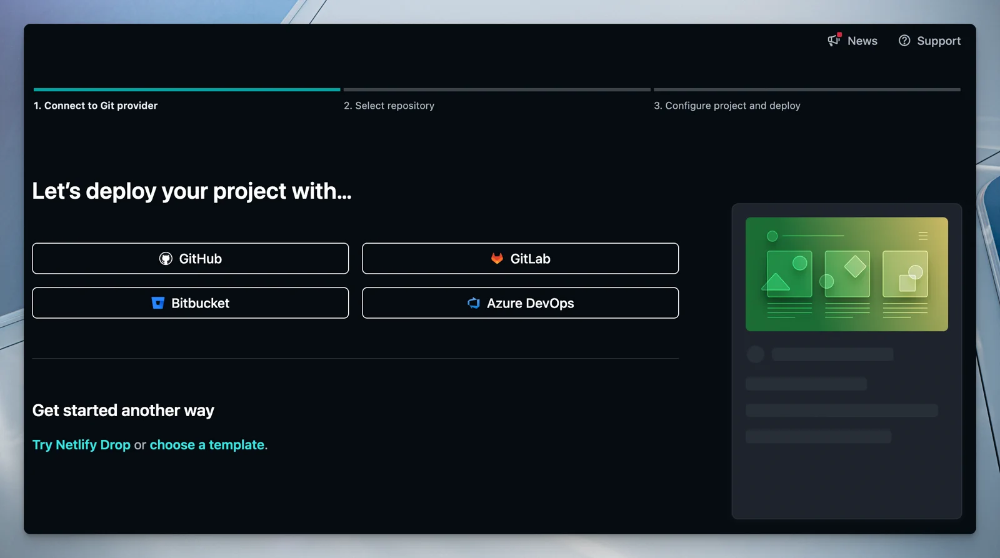

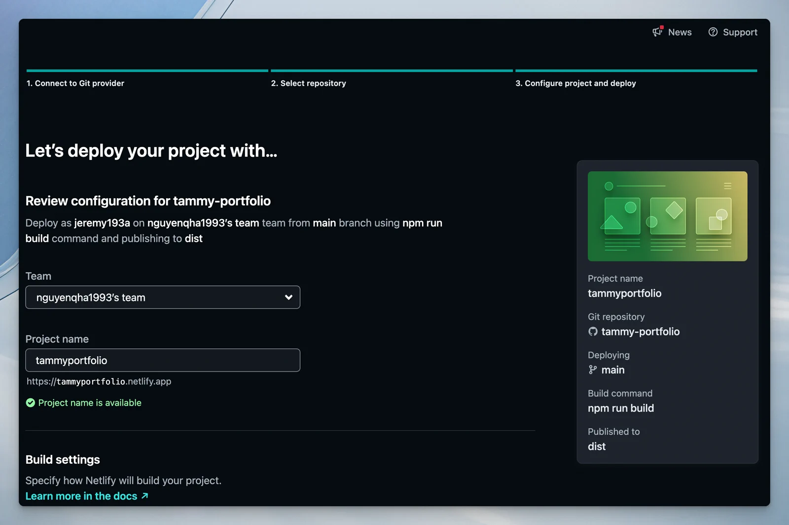

- Netlify sẽ tự phát hiện landing page của bạn được build bằng ngôn ngữ nào và tự đề xuất build command. Khái niệm về ngôn ngữ, mình sẽ hướng dẫn tiếp ở bên dưới.
- Bấm deploy.

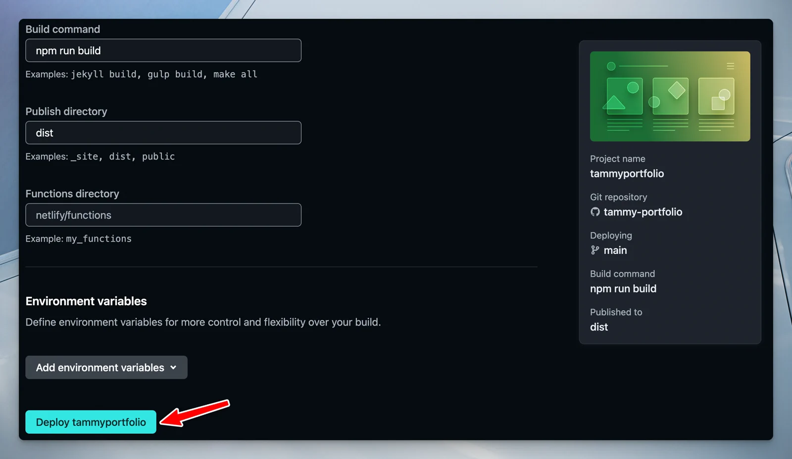

- Chờ đến khi Netlify thông báo build xong, bạn có thể truy cập vào đường link https://tammyportfolio.netlify.app/ để có thể xem Landing Page của mình. 

Vậy là cuối cùng bạn cũng có thể tự host landing page trong vòng chưa đến 5 phút khi trước đây chắc phải mất hàng kha khá thời gian để đọc tài liệu. 
### Trỏ tên miền vào landing page

Tiếp theo, hãy biến landing page được build bằng Netlify có đường link là tên miền bạn mua thay vì domain .netlify, ở đây mình sẽ sử dụng domain có tên là quangha.me mua ở Namecheap. Các bạn có thể mua tên miền Namecheap, giá rẻ nhiều lựa chọn.
- Chọn Add Domain và chọn tiếp Domain mà bạn đã sở hữu.
- Lưu ý là bạn phải bấm add 2 lần

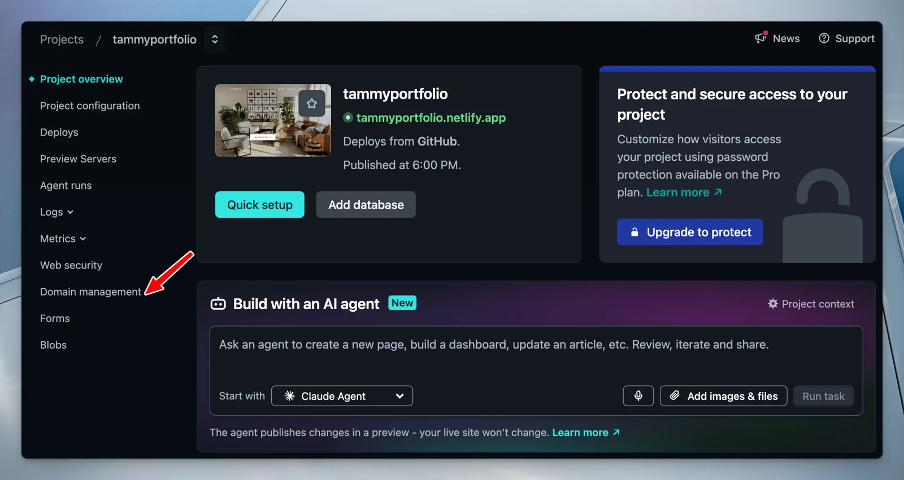

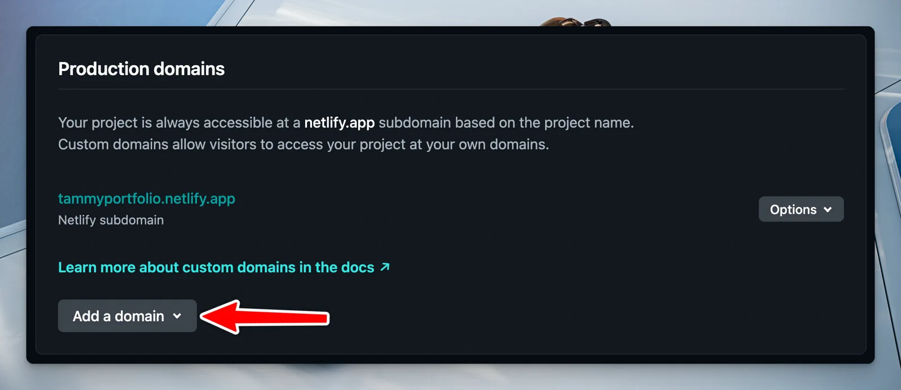

Setup DNS tại Netlify

DNS (Domain Name System) đơn giản là “danh bạ” của Internet: nó chuyển tên miền dễ nhớ (như quangha.me) thành địa chỉ IP số mà máy chủ hiểu, giúp người dùng gõ tên trang web thay vì nhớ dãy số.

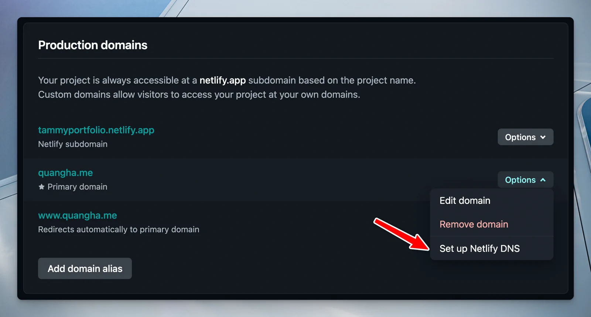

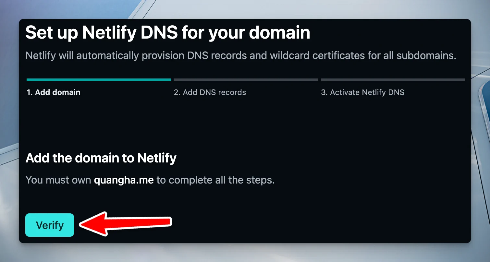

Bạn cần làm theo hướng dẫn của Netlify để có thể chuyển DNS của Namecheap thành DNS Netlify. Khi làm xong bước này bạn đã thành công "trỏ" tên miền là tên của bạn đến hosting Netlify, lưu ý có thể mất 24 giờ nhưng thường là ngắn hơn để tên miền của bạn có thể load trơn tru, vì vậy hãy tận hưởng một ly cafe và quay lại sau 5 đến 10 phút.

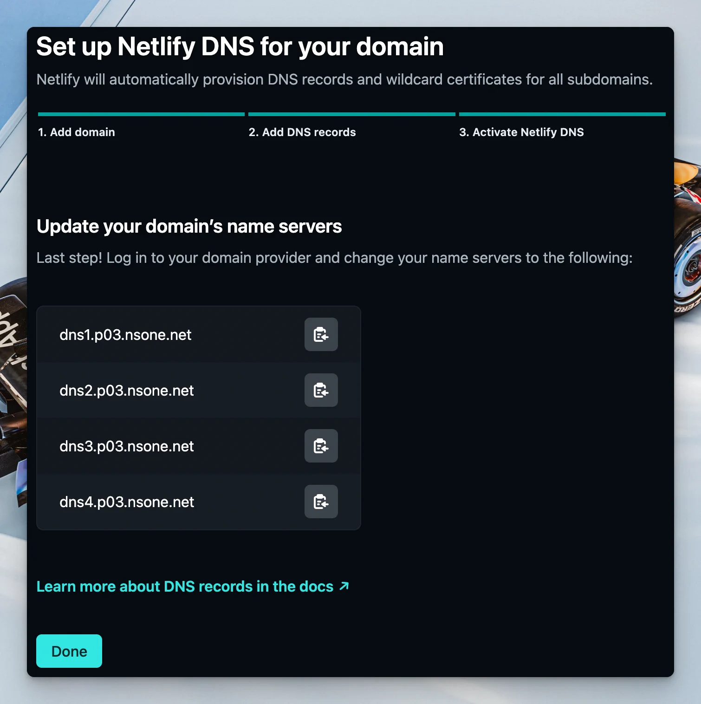

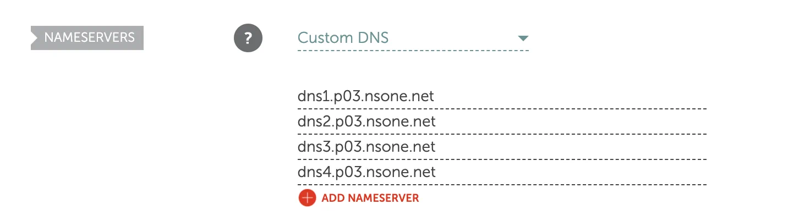

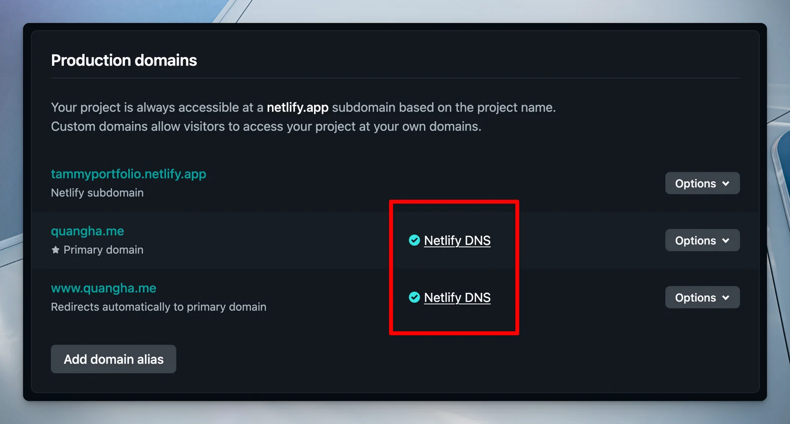

Vậy là bạn đã thành công hosting và truy cập được bằng tên miền của bạn chính landing page mà bạn đã build bằng AI. Ước tính thời gian nếu bạn đã có sẵn domain, các tài khoản GitHub và không cần thì mất tầm 1 tiếng. 
### Tiếp tục build theo ý thích với Codex và Cursor

Mình lúc mới tiếp cận và hiểu được các model có khả năng build nhanh một landing page với UI vừa đủ đẹp, và có thể có những tính năng mà ít khi nghĩ đến được. Nhưng đời không như là mơ, khi bạn phải nhận ra thực tế như sau:
- UI chỉ là dấu chấm đầu tiên, và UI được tạo ra từ AI có nhiều nội dung demo do AI tự nghĩ. Bên cạnh đó, trong thiết kế cũng có nhiều điểm dư thừa và không có UX tốt như sử dụng gradient quá đà, sử dụng quá nhiều hiệu ứng.
- Nhiều tính năng sẽ cần sự can thiệp thêm mà AI không thể làm giúp bạn ngay lúc thiết kế giao diện UI được. Ví dụ: khách hàng điền form, và thông tin từ form được truyền vào Google Sheet chẳng hạn. 
- Bạn chưa sử dụng được hình ảnh của chính mình, thay cho các hình ảnh được tạo sẵn từ AI.
- Quan trọng hơn cả, bạn cần có production standard của mình để tất cả trải nghiệm của bạn và người dùng cuối không cảm thấy đây là sự chấp vá của AI. Mình từng đi từ 0% - 90% trong 1 tiếng nhưng mất đến 2 tuần để chuẩn hóa 10% còn lại, nhưng như vậy là đã rất nhanh so với trước đây rồi.

Từ những concern trên mình sẽ đi đến phần 3 của bài viết. 

## Coding với AI cho người mới bắt đầu.

Mình sẽ phải công nhận việc coding với AI là không hề dễ dàng đối với những bạn chưa hề biết gì về code, nhưng với bài viết này, mình nghĩ mọi thứ sẽ dễ dàng hơn. Quay lại phần trên như mình đã đề cập, $20 một tháng cho ChatGPT mình nghĩ là có nhiều bạn đã bỏ tiền ra, và giờ đây là lúc để vắt kiệt nó :D

Trước hết hãy cùng nhìn một góc nhìn tổng quan về cách mà một landing pages với công nghệ hiện đại hoạt động. 
### Giải thích cơ chế hoạt động của một landing page theo sử dụng React

| 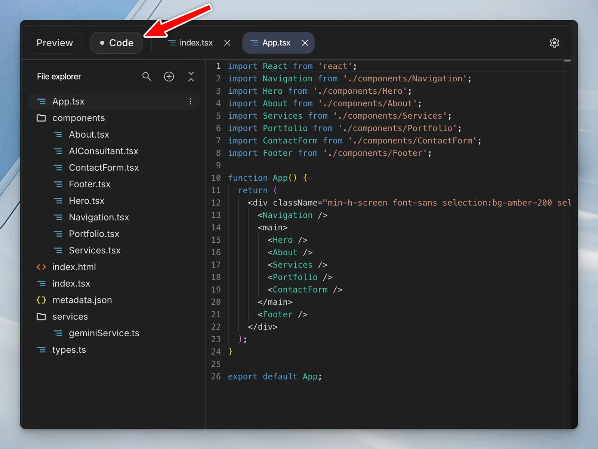                                                          |
| --------------------------------------------------------------------------------------------- |
| Trên Google AI Studio -> nhấn vào phần code để thấy các thành phần cấu thành nên Landing Page |

#### 1. Tổng quan kiến trúc
Landing page hoạt động theo mô hình Component-driven của React, gồm các section chính được render trong `App.tsx`. Nói một cách dễ hiểu, Landing Page của bạn sẽ được cấu thành bởi các section được viết riêng biệt và ghép nối lại với nhau thành một giao diện hoàn chỉnh.

```
App.tsx
 ├── Header
 ├── Hero
 ├── About
 ├── Services
 ├── Portfolio
 ├── Testimonials
 ├── Contact
 └── AIChatbot (widget)
```

Mỗi component tương ứng một section độc lập, giúp quản lý UI rõ ràng, dễ mở rộng, dễ bảo trì.
#### 2. App.tsx — Entry Point điều phối toàn bộ UI

- Root layout của toàn bộ landing page.
- Import và render tất cả các section.
- Định nghĩa cấu trúc HTML cơ bản: `<Header />`, `<main>`, `<footer>` (nếu có).
- Nói thêm một chút, bạn có thể học cơ bản về HTML và CSS. Đây là 2 ngôn ngữ cơ bản và rất tốt cho các bạn Digital Marketing muốn lên full-stack.
#### 3. Component-Based Rendering (cốt lõi của React)

Mỗi section là một component TSX độc lập:

- `Hero.tsx`
- `About.tsx`
- `Services.tsx`
- `Portfolio.tsx`
- `Testimonials.tsx`
- `Contact.tsx`
### Lợi ích:
- Tái sử dụng dễ dàng.
- UI rõ ràng, sạch sẽ.
- Dễ dàng thêm/bớt/tái cấu trúc.

React sẽ render theo thứ tự xuất hiện trong `App.tsx`.
#### 5. Vì sao công nghệ này phù hợp cho Landing Page?
- Hiệu năng cao, code tách biệt, dễ scale.
- Ngôn ngữ được hầu hết các AI platform sử dụng.
- Dễ tùy chỉnh UI.
- Deploy nhanh.
- Thân thiện với người mới học.

Vậy để toàn quyền chỉnh sửa Landing Page khi bạn không có kiến thức về code, non-tech? AI sẽ giúp bạn làm việc đó, xem tiếp phần sau.
### Khái niệm về Code Editor hay IDE và chuẩn bị nền tảng để dùng AI hỗ trợ coding:

Để có thể chỉnh sửa được source code của landing page, bắt buộc bạn phải có Code Editor chuyên dụng để có thể đọc được các file code cấu thành nên landing pages ở trên. Ở đây mình sẽ sử dụng Code Editor có tên là Cursor, và mình sử dụng combo Cursor + Codex của ChatGPT để thực hiện hầu hết các tác vụ về coding với AI.


| 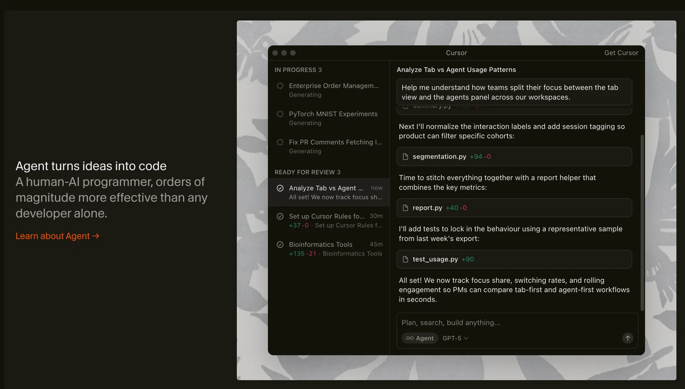                                                    |
| --------------------------------------------------------------------------------------- |
| Giao diện như các giao diện Chat với AI của Cursor, mình nghĩ là phù hợp cho người mới. |
Đầu tiên, bạn tải về Cursor (có đủ cho Win và Mac), đăng ký một tài khoản là có thể bắt đầu sử dụng. Để sử dụng được khả năng Coding Agent của ChatGPT bạn cần tích hợp Codex vào Cursor. 

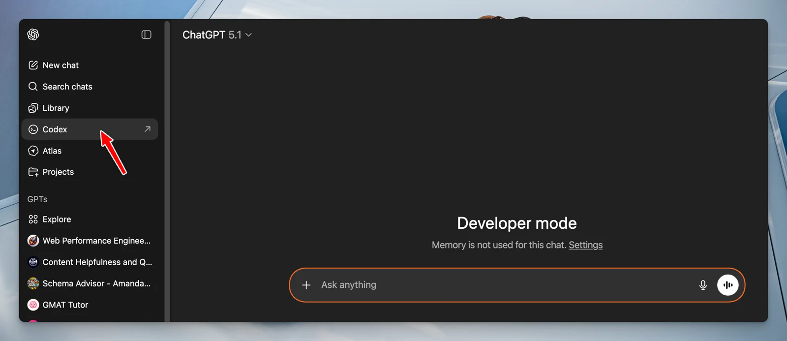

- ChatGPT phiên bản web và chọn tab Codex. Sau đó chọn try in your IDE chọn Cursor.
- ChatGPT sẽ điều hướng bạn đến Cursor và hướng dẫn cài đặt Codex Extensions cho Cursor.

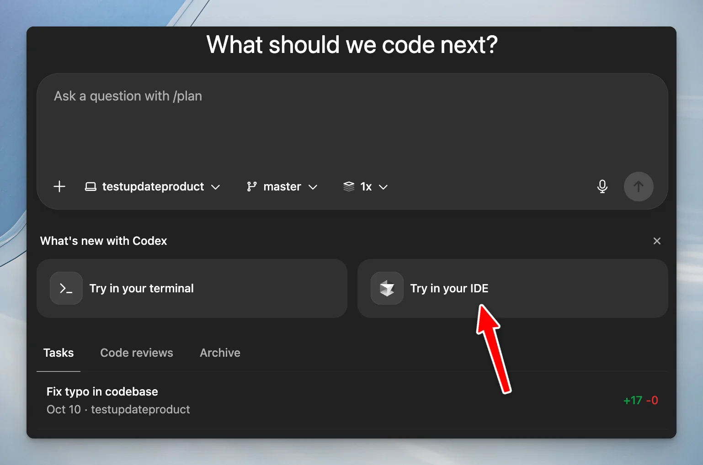

- Sau khi cài đặt extension, bạn cần điều hướng đến Codex với biểu tượng logo của OpenAI.
- Đăng nhập tài khoản ChatGPT Plus và có thể bắt đầu sử dụng Codex là người bạn hỗ trợ trong việc Coding.

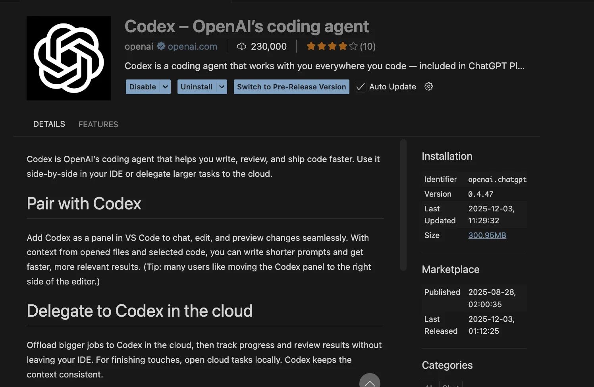

### Phát triển / Coding tại local bằng AI

Đến đây mọi thứ có vẻ phức tạp nhưng đừng panic, sự hào hứng sẽ tới sau những thứ phức tạp. Sau khi đã có Cursor + Codex hãy hình dung quy trình dưới đây để có thể code bất kì một landing page nào theo ý mình:

- Bước 1: Đem source code về local, việc phát triển trên nền tảng local sẽ an toàn, nhanh và bạn toàn quyền kiểm soát. Một landing page được build bằng React khá nhẹ cỡ vài trăm MB. 
- Bước 2: Để đem được source code về local, bạn cần mở terminal trên Cursor, bằng cách chọn Terminal từ Menu => New Terminal.
- Bước 3: Bạn cần tạo một folder để chứa source code trên máy tính. Làm theo các bước dưới đây
	 - 3.1: điều hướng đến folder bạn mới tạo
```
cd <kéo folder của bạn vào>
```

<iframe width="1270" height="733" src="https://www.youtube.com/embed/s5LtJttINkU" title="Hướng dẫn cơ bản cho người mới bắt đầu Coding bằng AI" frameborder="0" allow="accelerometer; autoplay; clipboard-write; encrypted-media; gyroscope; picture-in-picture; web-share" referrerpolicy="strict-origin-when-cross-origin" allowfullscreen></iframe>

	 - 3.2: clone source code từ GitHub
```
git clone <đường dẫn github>
```

 - Bước 4: Mở Cursor và chọn Open Folder, bước này sẽ điều hướng Cursor về source code của bạn. Hiểu rằng, bạn đang muốn Cursor đọc tất cả source code.
 - Bước 5: Mở Codex và bắt đầu ra lệnh cho AI phát triển thêm theo ý bạn. Thao tác chat nhu ChatGPT.

Tips:
- Hãy prompt với Codex như với một con người. Ví dụ:
	- Tôi muốn chỉnh text trên Hero Section to hơn 20%.
	- Tôi muốn thay thế hình của Section này bằng các hình tôi vừa đính kèm lên.
	- Tôi muốn giao diện Mobile thay đổi....
	- Tôi muốn bạn hướng dẫn tôi thực hiện các tính năng...

Đây là những bước tiêu chuẩn để có thể đem source code của bạn về local và sử dụng Codex Coding Agent của ChatGPT để bắt đầu Vibe Coding. Mặc định Codex sẽ setting reasoning ở mức Medium, chế độ Agent, ở các setting mặc định này là đã ổn cho việc vibe coding các project đơn giản như Landing Page build bằng React.

### Gắn "động cơ" để chạy được landing page trên local

Mặc định khi tải source code về, landing page sẽ chưa chạy được do thiếu thành phần Node.js - được hiểu là động cơ.
#### 📦 Bảng định nghĩa các câu lệnh npm thường dùng

| Câu lệnh                | Mô tả                                              | Mô tả cho người mới                                                                                   |
| ----------------------- | -------------------------------------------------- | ----------------------------------------------------------------------------------------------------- |
| `npm install` / `npm i` | Cài đặt toàn bộ dependencies trong `package.json`. | Bạn cần cài đặt động cơ cho landing page "chạy được"                                                  |
| `npm run dev`           | Khởi chạy development server (hot reload).         | Bạn xem thử landing page của mình đang chạy như thế nào. Dùng để phát triển trên máy tính.            |
| `npm run build`         | Build project để deploy, tạo thư mục `dist/`.      | Lắp ráp mọi thứ hoàn chỉnh, chuẩn bị đem lên Netlify hay CloudFlare Page để build.                    |
| `npm audit`             | Quét lỗ hổng bảo mật trong dependencies.           | Cần nhớ để vượt các lỗi khi được yêu cầu.                                                             |
| `npm audit fix --force` | Tự động sửa lỗ hổng dựa trên bản vá có sẵn.        | Cần nhớ để vượt các lỗi khi được yêu cầu nếu câu lệnh trên chưa thực hiện được việc vá lỗi khi build. |
Sau khi điều hướng xong Cursor và đã clone thành công source code, bạn cần gắn động cơ để landing page của bạn có thể chạy được trên local. 
- Trên Terminal đang mở gõ `npm install` và chờ cho đến khi thông báo thành công.
- Gõ tiếp `npm run dev` và bạn sẽ thấy đường link như http://localhost:3000/ click vào và tận hưởng thành quả khi Landing Page của bạn giờ đã chạy được trên Local.

Tips:
- Đôi khi Landing Page sẽ không chạy được cho dù bạn đã hoàn thành `npm install` và `npm run dev`. Hãy hỏi Codex fix lỗi cho bạn. Ví dụ: landing bị trắng, thường do UI ban đầu được xây bằng Gemini, Google sẽ hay inject Gemini Services vào. Bạn chỉ cần ra lệnh cho Codex, xử lý trắng page là xong.

### Commit lên GitHub - Netify tự động build

Sau khi hoàn tất customize theo ý, và ready to publish, bạn cần các bước sau đây:
- Sử dụng các câu lệnh `git add`, `git commit`, `git push` để đẩy source code đã customize của bạn lên GitHub
- Netlify khi đó sẽ nhận thấy GitHub của bạn có bản mới và bắt đầu build ngay lập tức. Đây chính là một đặc điểm giúp cho việc build sản phẩm nhanh và dễ hơn cho người mới bắt đầu.

Mong rằng sau bài viết này các bạn sẽ có được sản phẩm đầu tay bằng AI.

---

### 📫 Contact

**Hà “Jeremy” Nguyễn**  
*Make tech at ease.*

**Contact me through:**
- **Telegram:** [@jeremystack](https://t.me/jeremystack)
